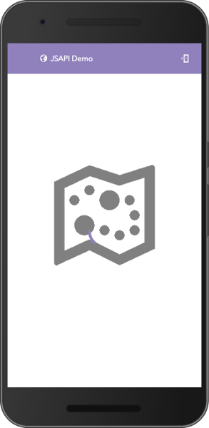
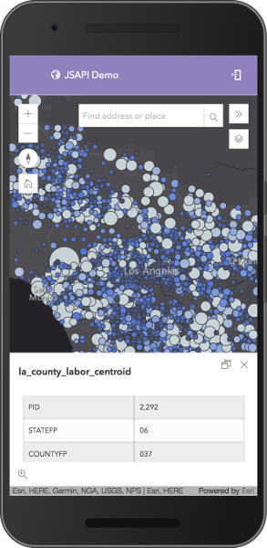

# Demo App for using TypeScript with [ArcGIS API 4 for JavaScript](https://developers.arcgis.com/javascript/)

## Usage

Clone the repo and run `npm install` or `yarn`.

* `npm run watch` - compile TypeScript and watch for changes.

Currently testing out what a _scalable_ application may look like for users of the JSAPI.
Still early testing, needs to show custom widgets, possibly some progressive web app tooling.

> Note - Be careful of how aggressive you cache via the service worker, you run the risk of not getting the latest data from Services that can change with updates. This is one area of this app I would call highly experimental.

Application structure influenced by libs/frameworks like Redux, Ember and Angular.

_Trying_ to use only NPM scripts for development, will see how far it can get me.

## App Shell

## Features

* Service Worker
* AppCache
* manifest.json - to add as button to home screen
* default icons
